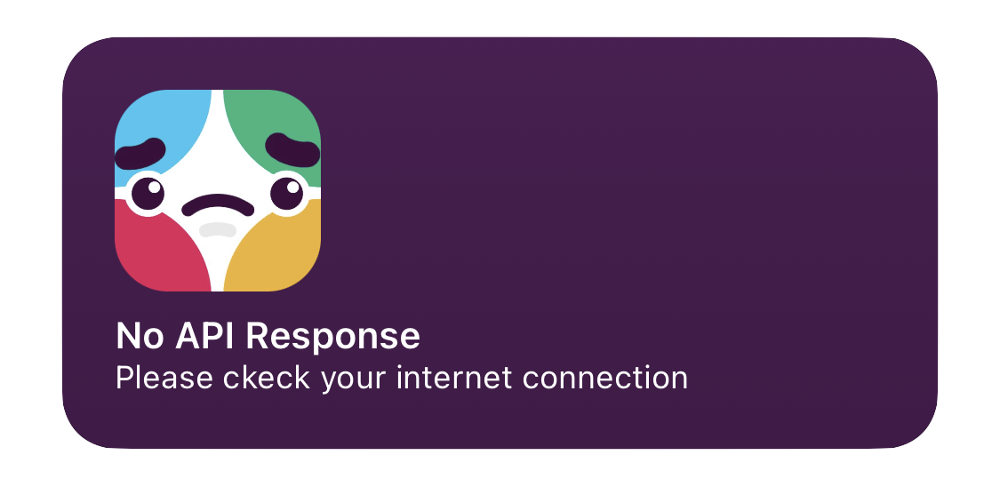

#  Slack-Status Widget for Scriptable

<!-- [](https://twitter.com/whothefuckishrb) -->


Script which displays the current Slack Status via API as [Scriptable](https://scriptable.app "Homepage") Widget.    
This is the missing widget for all power users of slack.

<!--
TL;DR: Download it [here](https://iamrbn.github.io/slack-status/Status%20Slack%20Widget.scriptable) fast as possible.
https://fifithebulldog.github.io/scriptable-testflight-watcher/TestFlight%20Watcher.scriptable
-->

<!-- <kbd> -->
 
<!-- </kbd> -->

**1.2.1 Update Notes** (19.07.2022)
- Fixed a problem where the widget displays an error when an open update is pending. Now it should work correctly again.

**1.2 Update Notes** (16.07.2022)
- Added push notifications for slack status [Beta]
- Improved the error/bad-connection widget
- Improved/thinned out some parts of the script - saved 70 lines of code

**1.1 Update Notes** (24.05.2022)
- Added selfupdate function[^1]
- Script thinned out in various places

## ✨ FEATURES

### Clickable Elements


<br>

<!-- ### Widget Specifications

Supports all sizes (_small, medium & large_)

 

 


___ -->

### The Widgets have a **Dynamic Background** and is available in all sizes


<br>

### Refresh Intervall

you can set it at every widget via widget parameter


<br>

### Run Script in App

By running the scirpt **In App** it will present a menu
It's including the current Slack Status in top


<br>

### Error / Bad Internet Connection

When the script cannot connect to the Slack API it will shown the Error Widget.



<br>

### Push Notifications ` [Beta] `

You'll get push-notifications if the status of slack changes.

```javascript
const getStatusNotifications = true;
```


<br>

## ⚙️ SETUP

### Set Refresh Intervall

1. Long tab the individual widget an chose `Edit "Scriptable"` or `Edit Widget`
2. set a number for the update intervall (_in minutes_) into the widget Parameter
3. finish - the script runs every `X` minutes yet.

**If it's not filled the script runs every 30 minutes!**

## ⬇️ INSTALL SCRIPT / WIDGET

### Install Script
1. Install [Scriptable for iOS `↗`](https://apps.apple.com/us/app/scriptable/id1405459188?ign-mpt=uo%3D4 "App Store")
2. Copy **each line** of the [Script `↗`](https://raw.githubusercontent.com/whothefuckishrb/slack-status/main/slack-status-widget.js)
or download [this](https://www.icloud.com/shortcuts/a1947fcd8071484ea157c19e68ded9d4) iOS helper shortcut <!-- or Download [this](https://raw.githubusercontent.com/whothefuckishrb/slack-status/main/Status%20Slack%20Widget.scriptable) scriptable-File -->
3. `+` Add new Script


4. Paste into the new Script
5. Finish

___

### Add Widget to Homescreen
1. Go to your homescreen and long tab anywhere
2. By tapping the `+` it will opens the gallery
3. chose or search for scriptable
4. Chose the widget-size and tap `"Add Widget"`
5. Tap the widget and choose the script, then set `"When Interacting" = "Run Script"` 
6. Finish

___

### On First Run

It will Downloads and Save the Following Symbols at the directory "slack-status-widget"

      

```
iCloud Drive/
├─ Scriptable/
│  ├─ slack-status-widget/
│  │  ├─ slackIcon.png
│  │  ├─ sadSlackBot-badConnection.png
│  │  ├─ ok.png
│  │  ├─ incident.png
│  │  ├─ notice.png
│  │  ├─ outage.png
│  │  ├─ maintenance.png
```
___


<a href="https://reddit.com/user/iamrbn">

</a>

<a href="https://twitter.com/iamrbn_">

</a>

<a href="https://mastodon.social/@iamrbn">

</a>


[^1]:[Function](https://github.com/mvan231/Scriptable#updater-mechanism-code-example "GitHub Repo") is written by the amazing [@mvan231](https://twitter.com/mvan231 "Twitter")
