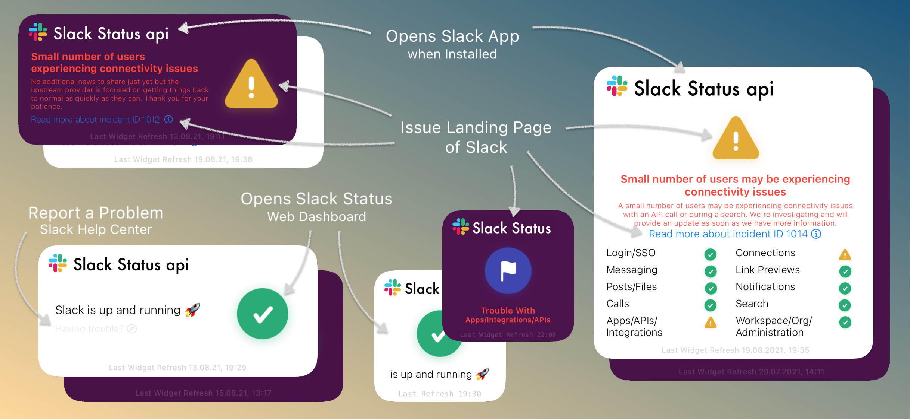
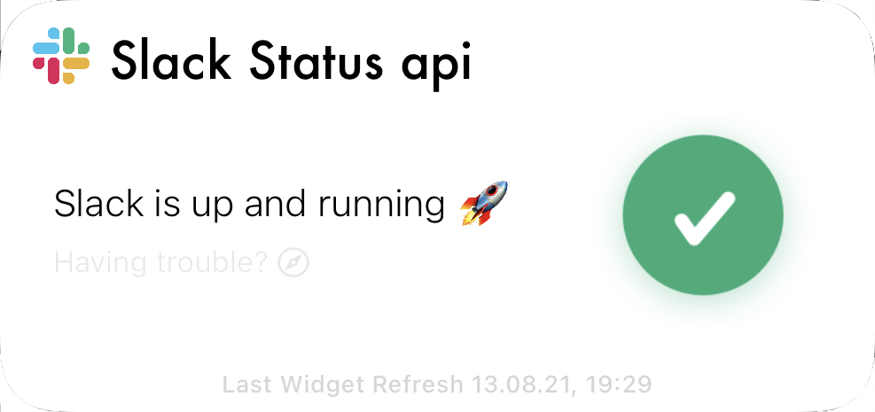
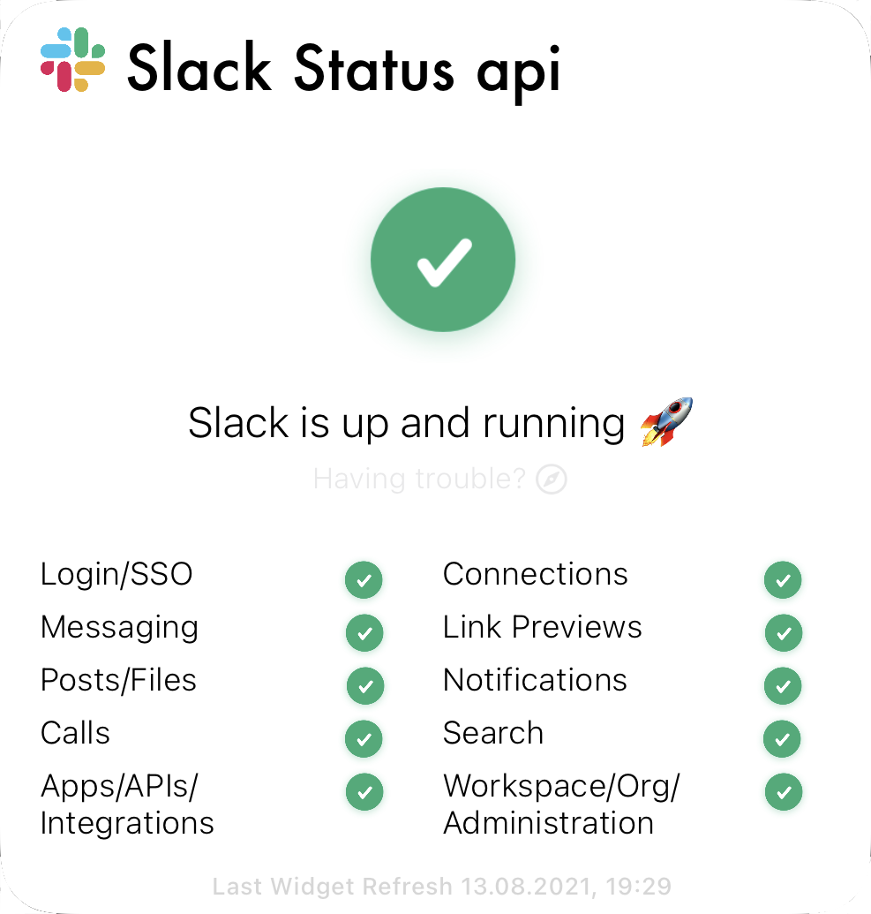
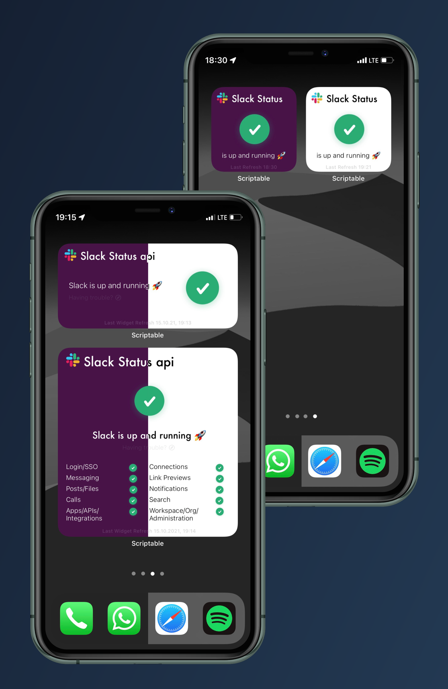
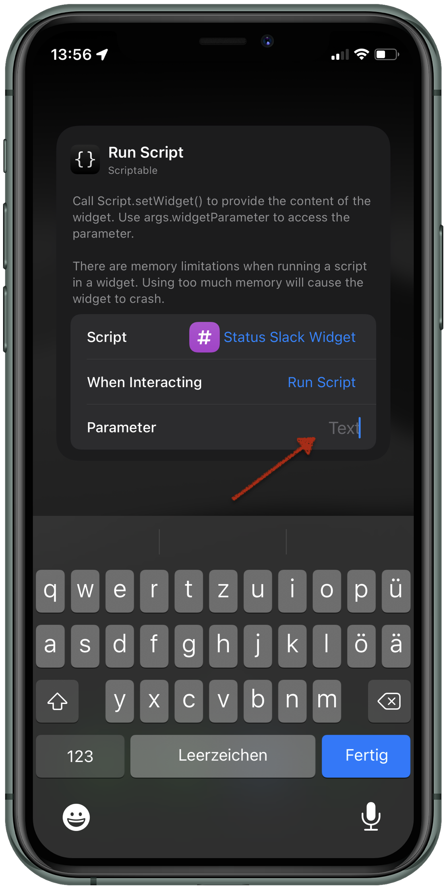
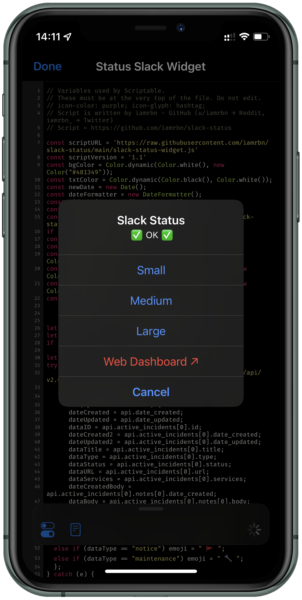
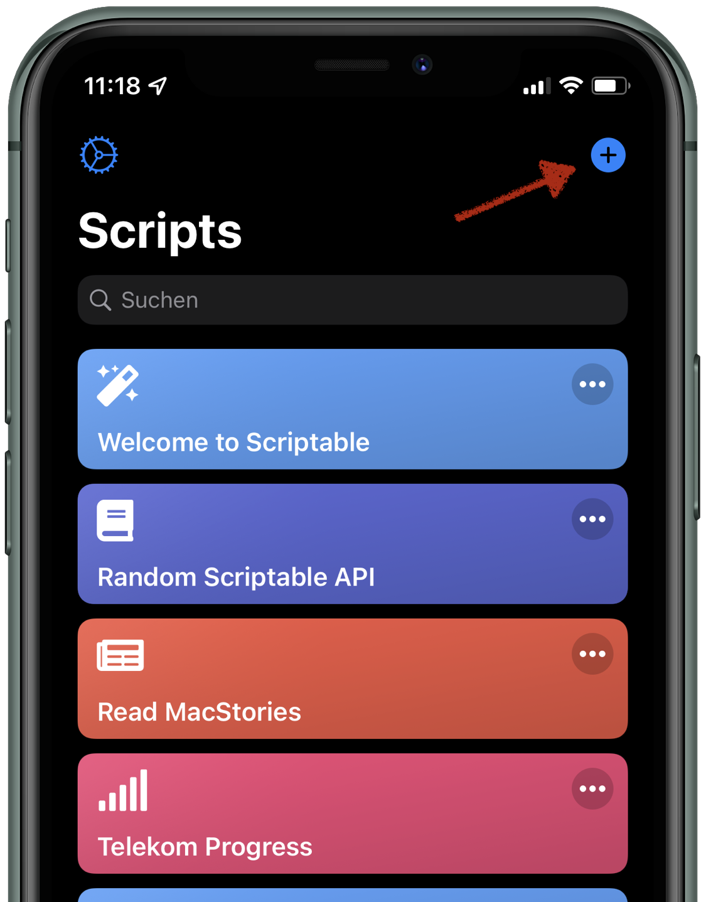
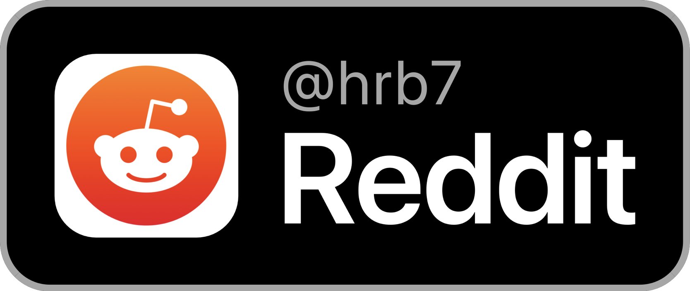
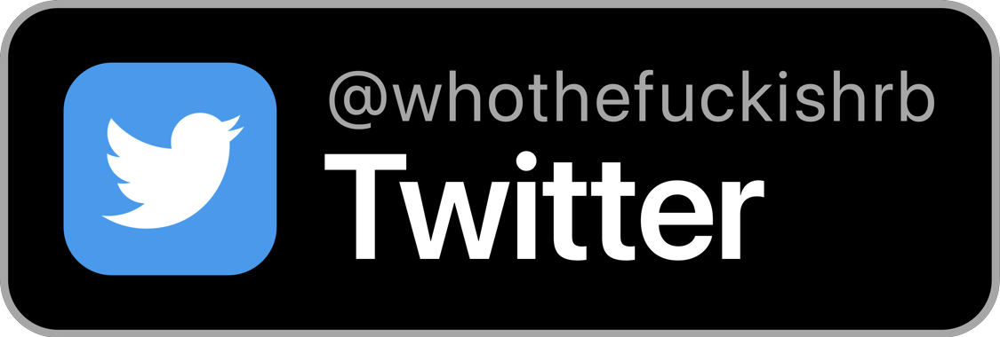

# Slack-Status Widget for Scriptable `{}` 

<!-- [](https://twitter.com/whothefuckishrb) -->


Script which displays the current   Slack Status via API as [Scriptable](https://scriptable.app "Homepage") Widget.

This is the missing script for all power Slack user.
<!-- <kbd> -->
 
<!-- </kbd> -->

## ✨ FEATURES

### Clickable Elements



___

<!-- ### Widget Specifications

Supports all sizes (_small, medium & large_)

 

 


___ -->

### The Widgets have a **Dynamic Background** and is available in all sizes



___

### Refresh Intervall

you can set it at every widget via widget parameter




___

### Run Script in App

By running the scirpt **In App** it will present a menu
It's including the current Slack Status in top




## ⚙️ SETUP

### Set Refresh Intervall

1. Long tab the individual widget an chose `Edit "Scriptable"` or `Edit Widget`
2. set a number for the update intervall (_in minutes_) into the widget Parameter
3. finish - the script runs every `X` minutes yet.

**If it's not filled the script runs every 30 minutes!**

## ⬇️ INSTALL SCRIPT / WIDGET

### Install Script
1. Install [Scriptable for iOS `↗`](https://apps.apple.com/us/app/scriptable/id1405459188?ign-mpt=uo%3D4 "App Store")
2. Copy **each line** of the [Script `↗`](https://raw.githubusercontent.com/whothefuckishrb/slack-status/main/slack-status-widget.js)
or download [this](https://www.icloud.com/shortcuts/a1947fcd8071484ea157c19e68ded9d4) iOS helper shortcut <!-- or Download [this](https://raw.githubusercontent.com/whothefuckishrb/slack-status/main/Status%20Slack%20Widget.scriptable) scriptable-File -->
3. `+` Add new Script



4. Paste into the new Script
5. Finish

___

### Add Widget to Homescreen
1. Go to your homescreen and long tab anywhere
2. By tapping the `+` it will opens the gallery
3. chose or search for scriptable
4. Chose the widget-size and tap `"Add Widget"`
5. Tap the widget and choose the script, then set `"When Interacting" = "Run Script"` 
6. Finish

___

### On First Run

It will Downloads and Save the Following Symbols at the directory "slack-status-widget"

     

```
iCloud Drive/
├─ Scriptable/
│  ├─ slack-status-widget/
│  │  ├─ Slack_Icon.png
│  │  ├─ OK.png
│  │  ├─ Incident.png
│  │  ├─ Notice.png
│  │  ├─ Outage.png
│  │  ├─ Maintenance.png
```
___

<a href="https://reddit.com/user/hrb7">

</a>


<a href="https://twitter.com/iamrbn_">

</a>
