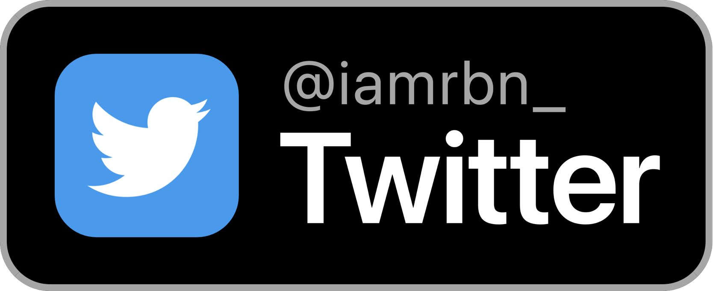

#  Slack-Status Widget for Scriptable

<!-- [](https://twitter.com/whothefuckishrb) -->


Script which displays the current Slack Status via API as [Scriptable](https://scriptable.app "Homepage") Widget.    
This is the missing widget for all power users of slack.

<!--
TL;DR: Download it [here](https://iamrbn.github.io/slack-status/Status%20Slack%20Widget.scriptable) fast as possible.
https://fifithebulldog.github.io/scriptable-testflight-watcher/TestFlight%20Watcher.scriptable
-->

<!-- <kbd> -->
 
<!-- </kbd> -->

<details>
  <summary><b>1.5 Update Notes (xx.11.2024)</b></summary>
  
- Added Update Widget
- improved No Connection Widget
- Small code improvements
</details>

<details>
  <summary><b>1.2.1 Update Notes (19.07.2022)</b></summary>
  
- Fixed a problem where the widget displays an error when an open update is pending. Now it should work correctly again.
</details>

<details>
  <summary><b>1.2 Update Notes (16.07.2022)</b></summary>
  
- Added push notifications for slack status [Beta]
- Improved the error/bad-connection widget
- Improved/thinned out some parts of the script - saved 70 lines of code
</details>

<details>
  <summary><b>1.1pdate Notes (24.05.2022)</b></summary>
  
  - Added selfupdate function[^1]
  - Script thinned out in various places
</details>

## ✨ FEATURES

### Clickable Elements


<br>

<!-- ### Widget Specifications

Supports all sizes (_small, medium & large_)

 

 


___ -->

### The Widgets have a **Dynamic Background** and is available in all sizes


<br>

### Run Script in App

By running the scirpt **In App** it will present the online dashboard of the current slack status


<br>

### Bad/No Internet Connection & Update Available

When the script cannot connect to the Slack API it will shown the Error Widget.

<br>

### Notifications of Status

 

<br>

## ⚙️ SETUP

```javascript
const getStatusNotifications = true //Set to false if you dont wanna get notifications!
const refreshInt = 60 //in minutes
```

### On First Run

It will Downloads and Save the Following Symbols at the directory "slack-status-widget"

      

```
iCloud Drive/
├─ Scriptable/
│  ├─ slack-status-widget/
│  │  ├─ slackIcon.png
│  │  ├─ sadSlackBot-badConnection.png
│  │  ├─ ok.png
│  │  ├─ incident.png
│  │  ├─ notice.png
│  │  ├─ outage.png
│  │  ├─ maintenance.png
```
___


<a href="https://reddit.com/user/iamrbn">

</a>

<a href="https://twitter.com/iamrbn_">

</a>

<a href="https://mastodon.social/@iamrbn">

</a>


[^1]:[Function](https://github.com/mvan231/Scriptable#updater-mechanism-code-example "GitHub Repo") is written by the amazing [@mvan231](https://twitter.com/mvan231 "Twitter")
