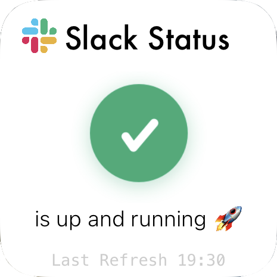

#  Slack-Status Widget for Scriptable


Script which displays the current Slack Status via API as [Scriptable](https://scriptable.app "Homepage") Widget.    
This is the missing widget for all power users of slack.

<details open>
  <summary><b>1.5 Update Notes (29.11.2024)</b></summary>
  
- Added update widget for lock- & homescreen
- Improved 'No Connection' widget
- Improved UI of the medium sized widget
- Small code improvements _(module & script)_
</details>

<details>
  <summary>Older Updates</summary>
    <details>
      <summary><b>1.41 Update Notes (30.10.2024)</b></summary>
  
  - Fixes a bug that triggers an error after changing the API content
  </details>

<details>
  <summary><b>1.3 Update Notes (28.05.2024)</b></summary>
  
  - Added rectangular lockscreen widget, styled like the medium one
  - Some services have been renamed by slack in the front- & backend
  - Some services have been also been added
  - The large widget has been adapted accordingly
  - Removed widget selection at the in-app dialogue - Now only the 'Web-Dashboard' is displayed
</details>

<details>
  <summary><b>1.2.1 Update Notes (19.07.2022)</b></summary>
  
- Fixed a problem where the widget displays an error when an open update is pending. Now it should work correctly again.
</details>

<details>
  <summary><b>1.2 Update Notes (16.07.2022)</b></summary>
  
- Added push notifications for slack status [Beta]
- Improved the error/bad-connection widget
- Improved/thinned out some parts of the script - saved 70 lines of code
</details>

<details>
  <summary><b>1.1 Update Notes (24.05.2022)</b></summary>
  
  - Added selfupdate function[^1]
  - Script thinned out in various places
</details>

</details>

## ✨ FEATURES

### Clickable Elements


<br>

<!-- ### Widget Specifications

Supports all sizes (_small, medium & large_)

 

 


___ -->

### The Widgets have a **Dynamic Background** and is available in all sizes


<br>

### Run Script in App
By running the scirpt **In App** it will present the online dashboard of the current slack status

<br>

### Bad/No Internet Connection & Update Available
If the script does not receive a response from the Slack API, it will be displayed in the widget.    
It also shows if there is an script update available.    
     


<br>

### Notifications of Status

 

<br>

## ⚙️ SETUP

```javascript
const getStatusNotifications = true //Set to false if you dont wanna get notifications!
const refreshInt = 60 //in minutes
```

### On First Run

      

```
iCloud Drive/
├─ Scriptable/
│  ├─ slack-status-widget/
│  │  ├─ slackIcon.png
│  │  ├─ sadSlackBot-badConnection.png
│  │  ├─ ok.png
│  │  ├─ incident.png
│  │  ├─ notice.png
│  │  ├─ outage.png
│  │  ├─ maintenance.png
```
___


<a href="https://reddit.com/user/iamrbn">

</a>

<a href="https://twitter.com/iamrbn_">

</a>

<a href="https://mastodon.social/@iamrbn">

</a>


[^1]:[Function](https://github.com/mvan231/Scriptable#updater-mechanism-code-example "GitHub Repo") is written by the amazing [@mvan231](https://twitter.com/mvan231 "Twitter")
